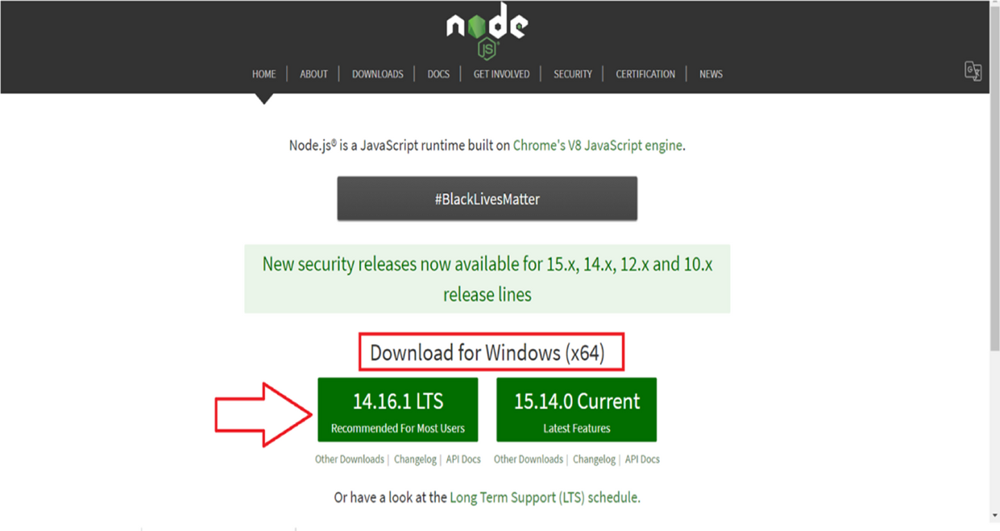
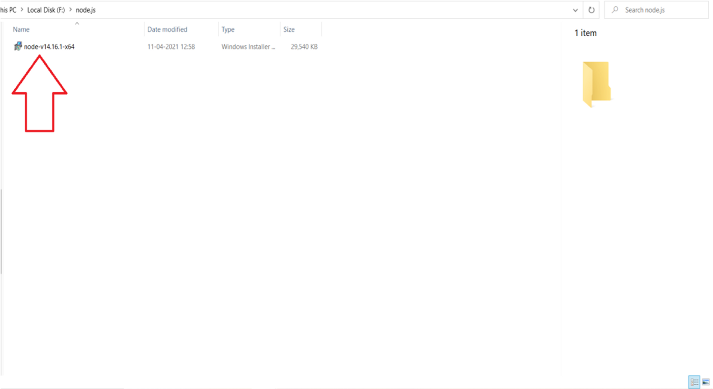
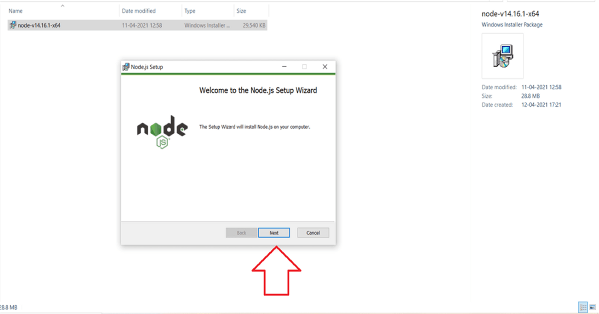
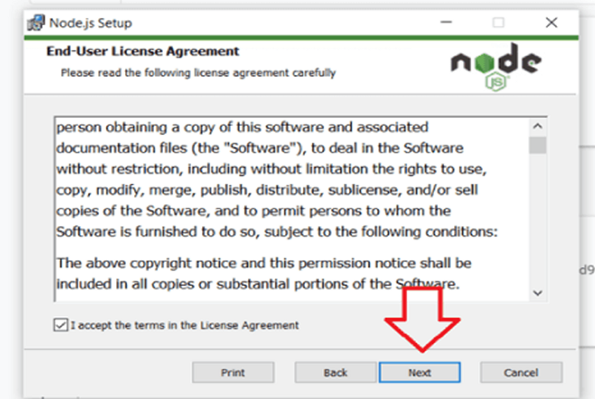
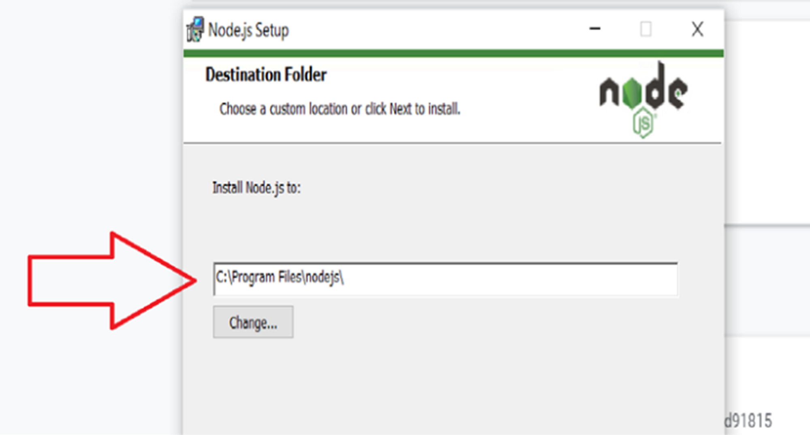
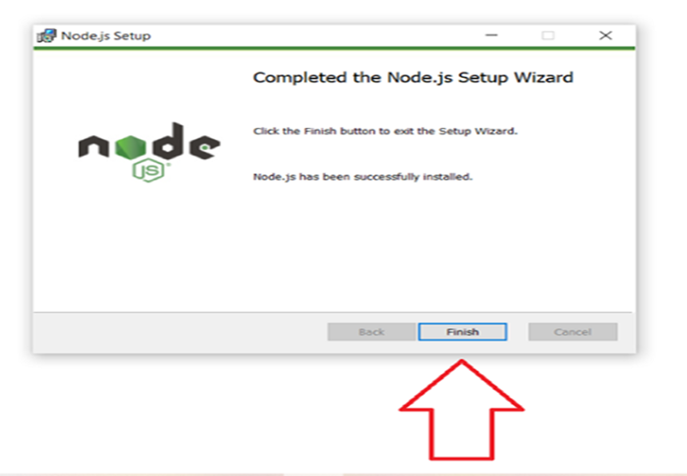

# Day 03: Linking Frontend and Backend

> Not the page you want to view? [Back to home page](../README.md)

In this theory session, we will be going through the basics of linking to a backend database. We will learn:

* Introduction to Application Programming Interface (API)
* Introduction to NodeJS
* POST and GET Requests

Some details about the event can be found in the [Event Page](https://gdsc.community.dev/events/details/developer-student-clubs-university-of-malaya-presents-gcpe-google-cloud-platform-for-everyone-workshop-2023-2023-03-25/). Below are some of the useful links that are relevant to the theory today.

* [Keynote](./assets/slide.pdf) by [Tiew Chee Yan](https://github.com/Cheeyan902) and [Lee Weng Hong](https://github.com/AsynchronousNotAvailable).
* [Slido Q&A Link](https://app.sli.do/event/8kuvZfCWdkGhNYoqKuVX6n/live/questions)

---

## Hands-On: Linking to Google Sheets Backend

This manual is written by [Tiew Chee Yan](https://github.com/Cheeyan902) and [Lee Weng Hong](https://github.com/AsynchronousNotAvailable), edited by by [Lim Jun Yi](https://github.com/LimJY03).

> In the workshop today, we will link our Website login page to a Google Sheets backend.

### Step 01: Installations and Set Up

We will start by installing NodeJS. Click [this link](https://nodejs.org/en/download) and click on the installer to download. Choose the secure file location to save your `install.msi` binary files.




Double-click the `install.msi` binary files to initiate the installation process and run it, then click the “Next” button.

> **Warning**
> <br>During security warning. Don’t click the cancel option to avoid repeating installing steps.



Read the terms of using the software and click the “Next” button.



Click the “Next” button for custom page set up since there is no any changes to be made.



Continue by clicking on the “Install” button. It may take a few minutes based on system performance for installation. You will get a success message as below:



To verify that node.js has been successfully installed in your system, open the terminal and **run it as administrators** by writing the command below to check the version of it.

```sh
node -v
```

Additionally, we will need to install Visual Studio Code (VS Code) from [this link](https://code.visualstudio.com/download).

### Step 02: Download login page template

Download the website template from [this GitHub repo](https://github.com/GCPE2023/GCPE2023-Website/tree/workshop-3-starter). To download it, click on the green "Code" button and click "Download ZIP", or you can:

```sh
# Only if you have Git installed
git clone https://github.com/GCPE2023/GCPE2023-Website.git
git checkout workshop-3-starter
```

If you downloaded the file with "Download ZIP", extract (unzip) the zip file to Desktop for easier navigation.

### Step 03: Set up Live Server extension

Now we will open up our VS Code, then click "File" > "Open Folder", then select the extracted folder

In your VS Code > Extensions > Enter Live Server in search bar > Click “Install” button > Enable Live Server Extension.

Then, right click on the `login.html` file at the left panel and choose "Open with Live Server". This will prompt you a button that brings you to the login page [hosted locally](https://www.hostinger.my/tutorials/what-is-localhost) in your device.

### Step 04: Modify the website content *(Optional)*

```diff
- Developing in progress ...
```

### Step 05: Creating a new Google Sheets

Using the account you use to sign up for Google Cloud Platform Free Trial, create a new Google Sheets and fill the first row with the following:


### Step 06: Writing App Script code

```js
const sheetName = 'Sheet1'
const scriptProp = PropertiesService.getScriptProperties()

function initialSetup () {
    const activeSpreadsheet = SpreadsheetApp.getActiveSpreadsheet()
    scriptProp.setProperty('key', activeSpreadsheet.getId())
}

function doPost (e) {
    const lock = LockService.getScriptLock()
    lock.tryLock(10000)

    try {
        const doc = SpreadsheetApp.openById(scriptProp.getProperty('key'))
        const sheet = doc.getSheetByName(sheetName)

        const headers = sheet.getRange(1, 1, 1, sheet.getLastColumn()).getValues()[0]
        const nextRow = sheet.getLastRow() + 1

        const newRow = headers.map(function(header) {
            return header === 'Date' ? new Date() : e.parameter[header]
        })

        sheet.getRange(nextRow, 1, 1, newRow.length).setValues([newRow])

        return ContentService
            .createTextOutput(JSON.stringify({ 'result': 'success', 'row': nextRow }))
            .setMimeType(ContentService.MimeType.JSON)
    }

    catch (e) {
        return ContentService
            .createTextOutput(JSON.stringify({ 'result': 'error', 'error': e }))
            .setMimeType(ContentService.MimeType.JSON)
    }

    finally {
        lock.releaseLock()
    }
}
```

```diff
- Developing in progress ...
```

### Step 07: Configure HTML Form

```html
<form id="my-form" method="POST"
    action="<YOUR_DEPLOYMENT_URL>">
    <input class="text-input" name="Email" type="email" placeholder="Email" required />
    <input class="text-input" name="Name" type="text" placeholder="Name" required />
    <input class="text-input" name="Number" type="text" placeholder="Phone number" required />
    <input class="text-input" name="Course" type="text" placeholder="Course" required />
    <input class="text-input" name="Year" type="text" placeholder="Year" required />
    <button type="button" id="authorize_button" onclick="handleAuthClick()">Upload Profile Picture</button>
    
    <input id="profile-link" class="text-input" name="Picture" type="text" placeholder="Not selected" required READONLY/>
    <button type="submit" class="submit" id="submit">Submit</button>
</form>
```

```html
<div id="loader" style="display:none;">
    
</div>
```

```diff
- Developing in progress ...
```

### Step 08: Enabling APIs and Configure Authentication

```diff
- Developing in progress ...
```

### Step 09: Deploy to Firebase

```diff
- Developing in progress ...
```

### Step 10: Clean Up

```diff
- Developing in progress ...
```

### Complete!

You have successfully linked your Website to a backend Google Sheets!

### More Readings

* [Other Practical Use Case](https://www.youtube.com/watch?v=K6Vcfm7TA5U)