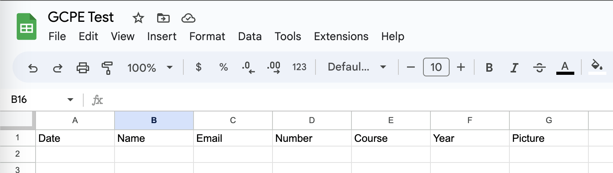
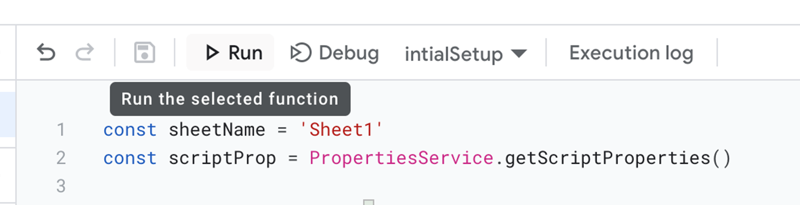
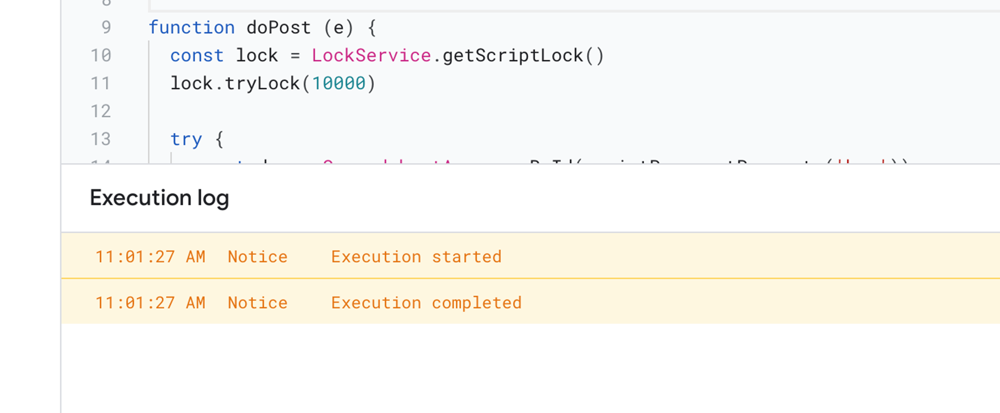
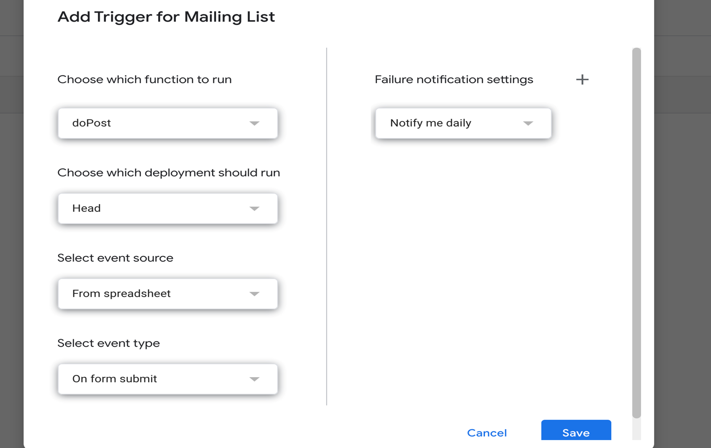
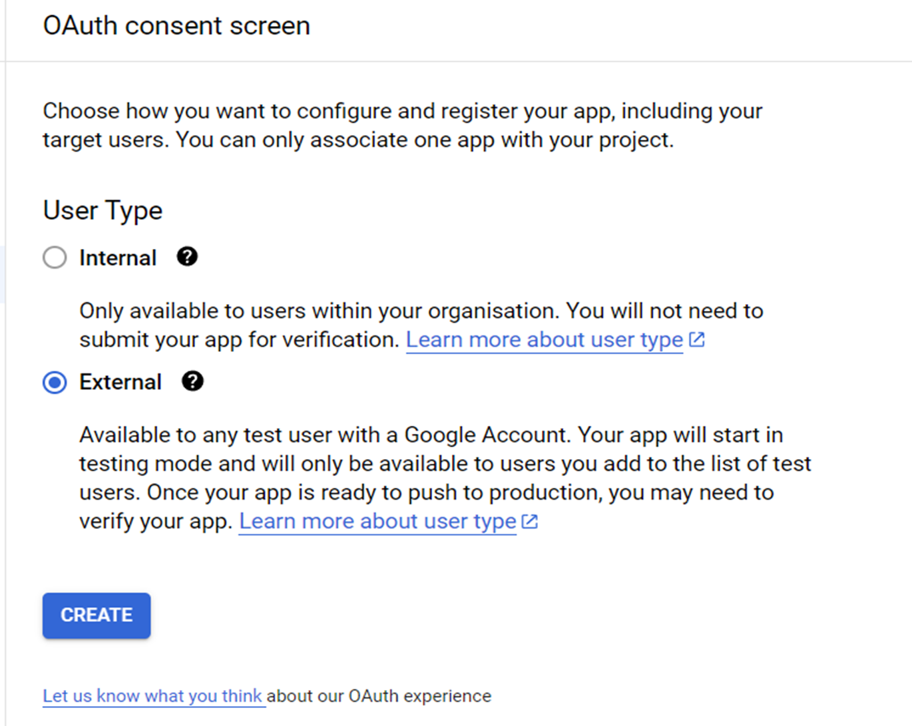
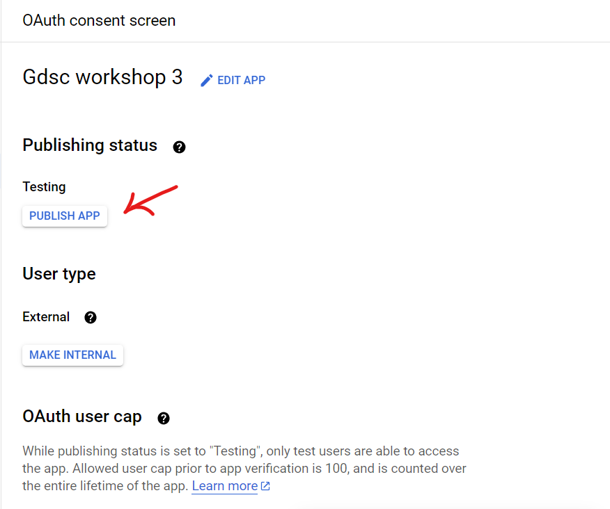
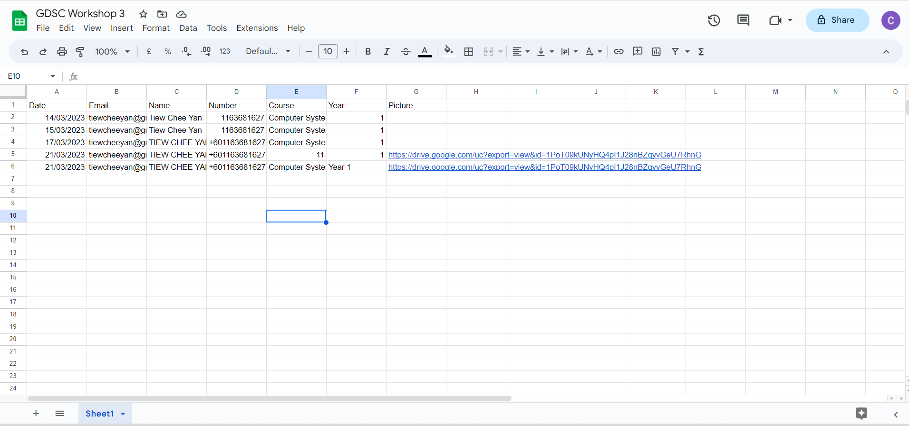

# Day 03: Linking Frontend and Backend

> Not the page you want to view? [Back to home page](../README.md)

In this theory session, we will be going through the basics of linking to a backend database. We will learn:

* Introduction to Application Programming Interface (API)
* Introduction to NodeJS
* POST and GET Requests

Some details about the event can be found in the [Event Page](https://gdsc.community.dev/events/details/developer-student-clubs-university-of-malaya-presents-gcpe-google-cloud-platform-for-everyone-workshop-2023-2023-03-25/). Below are some of the useful links that are relevant to the theory today.

* [Keynote](./assets/slide.pdf) by [Tiew Chee Yan](https://github.com/Cheeyan902) and [Lee Weng Hong](https://github.com/AsynchronousNotAvailable).
* [Slido Q&A Link](https://app.sli.do/event/8kuvZfCWdkGhNYoqKuVX6n/live/questions)

---

## Hands-On: Linking to Google Sheets Backend

This manual is written by [Tiew Chee Yan](https://github.com/Cheeyan902) and [Lee Weng Hong](https://github.com/AsynchronousNotAvailable), edited by by [Lim Jun Yi](https://github.com/LimJY03).

> In the workshop today, we will link our Website login page to a Google Sheets backend.

### Step 01: Installations and Set Up

We will start by installing NodeJS. Click [this link](https://nodejs.org/en/download) and click on the installer to download. Choose the secure file location to save your `install.msi` binary files.


Double-click the `install.msi` binary files to initiate the installation process and run it, then click the “Next” button.

> **Warning**
> <br>During security warning. Don’t click the cancel option to avoid repeating installing steps.


Read the terms of using the software and click the “Next” button.


Click the “Next” button for custom page set up since there is no any changes to be made.


Continue by clicking on the “Install” button. It may take a few minutes based on system performance for installation. You will get a success message as below:


To verify that node.js has been successfully installed in your system, open the terminal and **run it as administrators** by writing the command below to check the version of it.

```sh
node -v
```

Additionally, we will need to install Visual Studio Code (VS Code) from [this link](https://code.visualstudio.com/download).

### Step 02: Download login page template

Download the website template from [this GitHub repo](https://github.com/GCPE2023/GCPE2023-Website/tree/workshop-3-starter). To download it, click on the green "Code" button and click "Download ZIP", or you can:

```sh
# Only if you have Git installed
git clone https://github.com/GCPE2023/GCPE2023-Website.git
git checkout workshop-3-starter
```

If you downloaded the file with "Download ZIP", extract (unzip) the zip file to Desktop for easier navigation.

### Step 03: Set up Live Server extension

Now we will open up our VS Code, then click "File" > "Open Folder", then select the extracted folder

In your VS Code > Extensions > Enter Live Server in search bar > Click “Install” button > Enable Live Server Extension.

Then, right click on the `login.html` file at the left panel and choose "Open with Live Server". This will prompt you a button that brings you to the login page [hosted locally](https://www.hostinger.my/tutorials/what-is-localhost) in your device.

### Step 04: Modify the website content *(Optional)*

You may make some changes to the `index.html` file like changing your name, profile picture etc. Read more on some basic `HTML` in the [course keynotes of previous workshop](../Day02/assets/slide.pdf).

### Step 05: Creating a new Google Sheets

Using the account you use to sign up for Google Cloud Platform Free Trial, create a new Google Sheets.

Fill the first row with the following:



### Step 06: Writing Apps Script code

Now we will create a Google Apps Script. At the menu bar, click "Extensions" > "App Script".

Name the Google Apps Script to "GDSC Workshop 3". Then, delete everything (`myFunction() { ... }`) in the editor.

After deleting, paste the following code into the editor and save it by clicking the save icon next to the `Run` button.

```js
const sheetName = 'Sheet1'
const scriptProp = PropertiesService.getScriptProperties()

function initialSetup () {
    const activeSpreadsheet = SpreadsheetApp.getActiveSpreadsheet()
    scriptProp.setProperty('key', activeSpreadsheet.getId())
}

function doPost (e) {
    const lock = LockService.getScriptLock()
    lock.tryLock(10000)

    try {
        const doc = SpreadsheetApp.openById(scriptProp.getProperty('key'))
        const sheet = doc.getSheetByName(sheetName)

        const headers = sheet.getRange(1, 1, 1, sheet.getLastColumn()).getValues()[0]
        const nextRow = sheet.getLastRow() + 1

        const newRow = headers.map(function(header) {
            return header === 'Date' ? new Date() : e.parameter[header]
        })

        sheet.getRange(nextRow, 1, 1, newRow.length).setValues([newRow])

        return ContentService
            .createTextOutput(JSON.stringify({ 'result': 'success', 'row': nextRow }))
            .setMimeType(ContentService.MimeType.JSON)
    }

    catch (e) {
        return ContentService
            .createTextOutput(JSON.stringify({ 'result': 'error', 'error': e }))
            .setMimeType(ContentService.MimeType.JSON)
    }

    finally {
        lock.releaseLock()
    }
}
```

Then, we will run the `initialSetup()` function. Make sure that the dropdown at the right of the `Run` button is set to `initialSetup`, then click `Run`.



A warning window will pop up stating that "Google hasn't verified your app", click "Review Permission" > “Go to GDSC Workshop 3 (Unsafe)” to let the script have the correct permission to update your form.

Back in the Apps Script window, you should see similar output as below at the editor console:



At the sidebar of Apps Script, select "Triggers", then perform the following configuration in the pop up window that appears:



Then, click "Save" and click "Deploy" > "New Deployment". In the pop up window that appears:

* Description: Mailing List Form (or anything related)
* Web App -> Execute As: Me
* Web App -> Who has access: Anyone

Finally, click "Deploy", then copy the Web App URL and paste it somewhere else as it will be needed in the [next step](#step-07-configure-html-form).

### Step 07: Configure HTML Form

Back to the Visual Studio Code, open the `login.html` and paste the following code after the `WRITE FORM PART HERE` comment:

```html
<form id="my-form" method="POST"
    action="<YOUR_DEPLOYMENT_URL>">
    <input class="text-input" name="Email" type="email" placeholder="Email" required />
    <input class="text-input" name="Name" type="text" placeholder="Name" required />
    <input class="text-input" name="Number" type="text" placeholder="Phone number" required />
    <input class="text-input" name="Course" type="text" placeholder="Course" required />
    <input class="text-input" name="Year" type="text" placeholder="Year" required />
    <button type="button" id="authorize_button" onclick="handleAuthClick()">Upload Profile Picture</button>
    
    <input id="profile-link" class="text-input" name="Picture" type="text" placeholder="Not selected" required READONLY/>
    <button type="submit" class="submit" id="submit">Submit</button>
</form>
```

so it will look something like this:

```html
<!-- 
    WRITE FORM PART HERE
    REPLACE DEPLOYMENT URL IN 'ACTION'
-->
<form id="my-form" method="POST"
    action="<YOUR_DEPLOYMENT_URL>">
    <input class="text-input" name="Email" type="email" placeholder="Email" required />
    <input class="text-input" name="Name" type="text" placeholder="Name" required />
    <input class="text-input" name="Number" type="text" placeholder="Phone number" required />
    <input class="text-input" name="Course" type="text" placeholder="Course" required />
    <input class="text-input" name="Year" type="text" placeholder="Year" required />
    <button type="button" id="authorize_button" onclick="handleAuthClick()">Upload Profile Picture</button>
    
    <input id="profile-link" class="text-input" name="Picture" type="text" placeholder="Not selected" required READONLY/>
    <button type="submit" class="submit" id="submit">Submit</button>
</form>
```

Then, replace the `<YOUR_DEPLOYMENT_URL>` for the value of the `action` argument of the `<form>` tag with your copied URL in [the previous step](#step-06-writing-apps-script-code).

Next, we will add the loading animation upon submission. This is because it will take some time for our Firebase server to fetch data from our web application and store in our Google Sheets.

Paste the following code below the `<!-- WRITE LOADER PART HERE -->` comment:

```html
<div id="loader" style="display:none;">
    
</div>
```

And it should look something like this:

```html
<!-- WRITE LOADER PART HERE -->
<div id="loader" style="display:none;">
    
</div>
```

# Step 08: Deploy to Firebase

Now, we will deploy our web application to firebase with the following steps that are similar to the steps from the [previous workshop](../Day02/README.md):

1. Log in your firebase account in the [Firebase Website](https://firebase.google.com/) and create a new project.
2. Open the firebase CLI, in the CLI type the following commands one by one:
    
    ```sh
    firebase login
    ```
    ```sh
    firebase init hosting
    ```
3. Perform the following initialization configurations:
    
    * `? Please select an option:` choose `Use an existing project`
    * `? Select a default firebase project for this directory:` choose your created firebase project just now
    * `? What do you want to use as your public directory?` choose `public`
    * `? Configure as a singple-page app (rewrite all URLs to /index.html)?` choose `yes`
    * `? Set up automatic builds and deploys with GitHub?` choose `no`
    * `? File public/index.html already exist. Overwrite?` choose `no`

4. Deploy to firebase with the following command
    
    ```sh
    firebase deploy
    ```

Then, copy the deployed web application URL as it will be used in [Step 09](#step-09-enabling-apis-and-configure-authentication).

### Step 09: Enabling APIs and Configure Authentication

Since we are using multiple Google services for this hands-on session, we will need to enable the relevant APIs that we are going to use in order to access the services.

To enable the Google APIs, open your [Google Cloud Platform Console](https://console.cloud.google.com/) and sign in with the account you used to activate free trial. But before that, let's create a GCP Project.

In the GCP Console, navigate to "IAM and admin" > "Create a project" at the navigation pane. You can put any project name that is globally unique. Then, click "Create". You will then be automatically brought to the project dashboard.

Next, navigate to "APIs & Services" and search for the following APIs and enable them individualy:

* Google Sheets API
* Google Drive API

We enable Google Sheets API because we will need to access our Google Sheets backend database to store the data from the `login.html` form we done in [Step 07](#step-07-configure-html-form). We also need to enable Google Drive API since we will need to use Google Drive to store the image to be uploaded in the form.

After we have enabled the APIs, we will need to configure OAuth Consent and register our web application to the current GCP project.

Under "APIs and Services", navigate to "OAuth Consent Screen". Set the "User Type" to "External" as shown in the picture below:



Then, click "Create". In the next section, perform the following configurations:

* App name: "GDSC Workshop 3 Login App"
* User support email: your project email
* Developer contact information Email: your project email

Then, click "Save and Continue". For the "Scope" page and the "Test Users" page, click "Save and Continue" for both as we do not need to modify anything. Finally, click "Back to Dashboard".

This will bring you back to the OAuth Consent Screen page, click "Publish App" tto publish your app so that any user can access it without any verification.



After we are done with OAuth Consent, navigate to "Credentials" under "APIs and Services" and click `+ CREATE CREDENTIALS` > "API Key". Then, copy the API key generated as it will be used in the [next step](#step-10-redeploy-to-firebase).

Again, click `+ CREATE CREDENTIALS` but this time choose "OAuth Client ID". In the "Create OAuth Client ID" page, perform the following configurations:

* Application type: "Web application"
* Name: "GDSC Workshop 3 Login"
* Authorized JavaScript origins URIs 1: your copied deployed web application URL in [Step 07](#step-07-configure-html-form)

Finally, click "Create", then copy "Your Client ID" as it will be used in the [next step](#step-10-redeploy-to-firebase).

### Step 10: Redeploy to Firebase

Back to the Visual Studio Code, open the `postSuccess.js` file and make the following configurations:

* Replace the `REPLACE YOUR CLIENT ID` with your copied Client ID in the [previous step](#step-09-enabling-apis-and-configure-authentication).
* Replace the `REPLACE YOUR API KEY` with your copied API Key also in the [previous step](#step-09-enabling-apis-and-configure-authentication).
* Replace the `REPLACE YOUR APP ID` with the string of numbers before the first `-` in the Client ID.
    * If the Client ID is `'01234567-UfajCjkajFa ...'`, the App ID is `'01234567'`.

Then, save all files and then redeploy your web application to Firebase using the same deployment steps in [Step 08](#step-08-deploy-to-firebase).

After the deployment is successful, you can try the login form out by clicking "Log In" at the sidebar. 

To upload a picture, choose your project email and select your picture uploaded in the google drive of the project email.

> **Note**
> <br>A danger pop up will occur when you click the "Choose File" button which states that "Google hasn't verified this app", just click "Advanced" > "Go to ... (unsafe)" > "Continue".

After you pressed the submit button, wait until a message “Success!” pops up. This means your form data has been successfully sent into the Google Sheets.

Then you can open your Google Sheets and check if the data are already in, which will look something like below:



### Step 11: Clean Up

If you don't want to use the created web application anymore, just delete the Firebase project as well as the GCP project created in this hands-on session.

### Complete!

You have successfully linked your Website to a backend Google Sheets!

### More Readings

* [Other Practical Use Case](https://www.youtube.com/watch?v=K6Vcfm7TA5U)