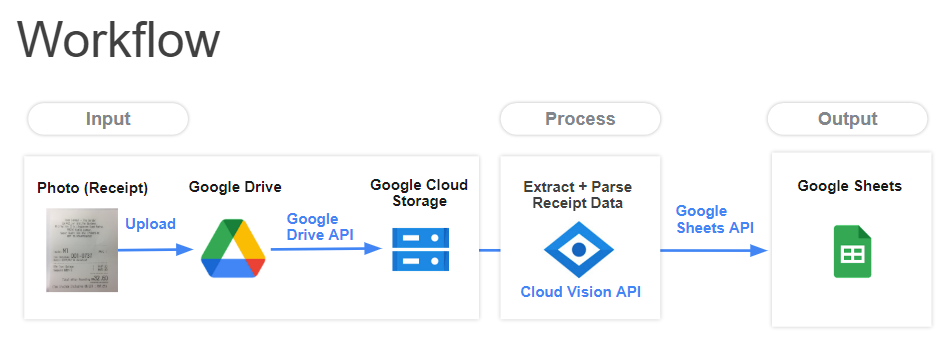

# Day 04: Integrating AI in Your Website

> Not the page you want to view? [Back to home page](../README.md)

In this theory session, we will be going through the application of AI. We will learn:

* Storage options on Google Cloud
* Vision API on Google Cloud
* JSON Object

Some details about the event can be found in the [Event Page](https://gdsc.community.dev/events/details/developer-student-clubs-university-of-malaya-presents-gcpe-google-cloud-platform-for-everyone-workshop-2023-2023-03-26/). Below are some of the useful links that are relevant to the theory today.

* [Keynote](./assets/slide.pdf) by [Lim Hui Ern](https://github.com/huiern214) and [Vanessa Jing Taing](https://github.com/Vanessa-Taing)
* [Slido Q&A Link](https://app.sli.do/event/7KBiwvEjSCK3agsmE6yBvJ/live/questions)
* [Google Cloud Storage Options](https://cloud.google.com/products/storage)
* [What is Vision API](https://cloud.google.com/vision)
* [Understanding JSON](https://developer.mozilla.org/en-US/docs/Learn/JavaScript/Objects/JSON)

---

## Hands-On: Extracting Receipt Data

This manual is written by [Lim Hui Ern](https://github.com/huiern214) and [Vanessa Jing Taing](https://github.com/Vanessa-Taing), edited by by [Lim Jun Yi](https://github.com/LimJY03).

> In the workshop today, we will create a Receipt Data Extractor.

You can alternatively refer to these videos and follow along at your own pace:

* [Hands On Session 1](./assets/Hands_On_Session1.mp4)
* [Hands On Session 2](./assets/Hands_On_Session2.mp4)
* [Hands On Session 3](./assets/Hands_On_Session3.mp4)

The workflow for the hands-on session today is shown in the diagram below:



### Step 01: Download Relevant Files

Download the sample receipts and Python code from [this repo](https://github.com/GCPE2023/ReceiptExtractor). To download it, click on the green "Code" button and click "Download ZIP", or you can:

```sh
# Only if you have Git installed
git clone https://github.com/GCPE2023/ReceiptExtractor.git
```

If you download this repository as a zipped file, unzip it as we will be using the `receipt-extractor.py` file in this repository.

### Step 02: Uploading Receipts to Google Drive

Using the Google Account that has Google Cloud Platform Free Trial activated, open the Google Drive and create a folder for your project. We will rename it to "Cloud" (you can rename it to whatever name you want).

In the "Cloud" (or the foldername you created) folder, create a new folder called "receipt". This folder will be used to store all the input receipt images before it is processed.

In the "receipt" folder, upload the sample receipt images you have downloaded in [Step 01](#step-01-download-relevant-files) to this folder. Then, copy the Folder ID (the string of characters after `/folder/` in the URL) of this folder and paste it in some place (eg. notepad) to be used later on.

You may also upload your other receipt images into this folder as well.


### Step 03: Creating a new Google Sheets

Back to the "Cloud" folder (the folder that contains the "receipt" folder), create a new Google Sheet and set the name to be "Receipt_Data".

Copy the Sheets ID (the string of characters between `/spreadsheets/d/` and `/edit#gid=0`) of this Google Sheet and paste it with your Folder ID in [Step 02](#step-02-uploading-receipts-to-google-drive) to be used later on.

Fill in the first row of the google sheets with the following horizontally.

* Cell A1: Date
* Cell B1: Image
* Cell C1: Shop Name
* Cell D1: Address
* Cell E1: Total Price
* Cell F1: Upload Time

Now, your Google Sheets should look like the image below.


Then, select the first column (column for "Date"), then click "Format" > "Number" > "Date".


### Step 04: Creating Cloud Bucket

Type "Buckets" in the search tab of the Google Cloud Platform Console or navigate by "Cloud Storage" > "Buckets" from the navigation bar. 

Click on the `+ CREATE` button to create a cloud bucket, then make the configurations below. You will need to press the "Continue" button while creating the bucket for each section below.

* Bucket Name: Any name that is globally unique (copy this name with your Folder ID and Sheets ID as it will be used later on)
* Location Type: Choose "Region", then choose "asia-southeast1 (Singapore)"
* Storage Class: Choose "Standard"
* Prevent Public Access: **Untick** "Enforce public access prevention on this bucket"
* Access Control: Choose "Fine-grained"
* Protection Tool: "None"

Your bucket has been created.

> **Note**
> <br>[Checkpoint] you should have 3 things copied and stored in a place:
>
> * Folder ID (copied in [Step 02](#step-02-uploading-receipts-to-google-drive))
> * Sheets ID (copied in [Step 03](#step-03-creating-a-new-google-sheets))
> * Bucket Name (copied in this step)

### Step 05: Enabling Relevant APIs

We will be enabling 3 APIs that will be used for this hands-on session.

One way is to do it manually. Navigate to "APIs & Services" and search for the following APIs and enable them individualy:

* Google Drive API
* Cloud Vision API
* Google Sheets API

or alternatively, you could use the `gcloud` command in the Cloud Shell with the following command:

```sh
gcloud services enable drive.googleapis.com vision.googleapis.com sheets.googleapis.com
```

### Step 06: Authorizing APIs

> **Note**
> <br>This section can be skipped if you've already created user account authorization credentials. 

Still under "APIs & Services", navigate to "OAuth Consent Screen" and choose "External" for user type.

* Then in the "OAuth Consent Screen" page, make the following configurations:
    * App Name: "Receipt Extractor"
    * User Support Email: Your project email
    * Developer Contact Information: Set the email to be your project email
* Then click "Save & Continue".
* In the "Scope" page, you don't need to modify and configurations so just click "Save & Continue".
* In the "Test Users" page, click `+ ADD USERS` and add your project email. Then click "Add" and "Save & Continue".
* In the "Summary" page, scroll to the bottom and click "BACK TO DASHBOARD".

Next, we will be creating our OAuth Client ID. Under "APIs & Services", navigate to "Credentials" and click `+ CREATE CREDENTIALS` > "OAuth Client ID".

In the "OAuth Client ID" page, set the "Application Type" to "Desktop app" and click "CREATE".

After the creation is complete, a window will then pop up indicating the creation success. In the pop up window, click "Download `JSON`".

If you closed the window already, you can click the download icon under "OAuth 2.0 Client IDs" to download the `JSON` file.


Rename the `JSON` file as `client_secret.json`.

### Step 07: Coding on Cloud Shell Editor

Activate the GCP Cloud Shell then click "Open Editor". This will create a "VSCode"-like cloud editor environment where we can use to execute our codes in the cloud.


Click the 3 dots next to the "Open Terminal" button and click "Upload Files". There are two files that you will need to upload to this Shell Editor:

* `receipt-extractor.py` that you have downloaded from the GitHub repo in [Step 01](#step-01-download-relevant-files).
* `client_secret.json` that you have downloaded in [previous step](#step-06-authorizing-apis).

> **Warning**
> <br>Both files should not be uploaded into any folder.

After both files are uploaded, click on `receipt-extractor.py` to modify the code content in the following lines:

* Replace the `'BUCKET_NAME'` in line 19 with your Bucket Name.
* Replace the `'SHEETS_ID'` in line 21 with your Sheets ID.
* Replace the `'FOLDER_ID'` in line 52 with your Folder ID.

Then, we will be generating our `storage.json` file. Click "Terminal" > "New Terminal" and a terminal should appear at the bottom of the screen.


In the terminal, paste the following command:

```sh
python3 receipt-extractor.py --noauth_local_webserver
```

The terminal will generate an output link that looks something like this:

```
Go to the following link in your browser:

    https://accounts.google.com/o/oauth2/auth?client_id= ...

Enter verification code: 
```

Click the link and a prompt should pop out asking your verification. Check all boxes for "Select what Receipt Extractor can access" then click "Continue".

Next, under the "Authorization Code" section, copy the authorization code. Then, back to the Cloud Shell Editor Terminal, paste the authorization code right after the `Enter verification code:` prompt. Then, press Enter.

After the command executes successfully, the `storage.json` file should be generated.

Now, we will start to execute our program by using the following command in the terminal:

```sh
python3 receipt-extractor.py
```

This will load all receipt images in the Google Drive, process them through the Cloud Vision API and then produce the extracted receipt data into the Google Sheets.

> **Note**
> <br>If you wish to execute more receipt images extraction in the future, upload them into the same Google Drive folder and then run the `python3 receipt-extractor.py` command again in the Cloud Shell Editor Terminal.

### Step 08: Clean Up

If you do not need to use the receipt data extraction anymore, just disable all APIs that you have enabled in [Step 05](#step-05-enabling-relevant-apis).

### Complete!

You have successfully extracted your receipt data in batches!

### More Readings

* [Google Cloud Vison API Documentations](https://cloud.google.com/vision/docs)