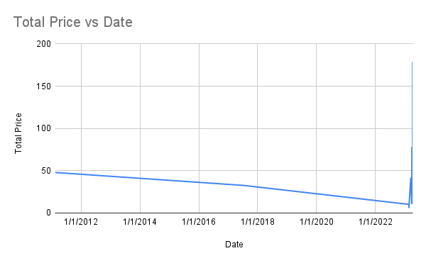

# Day 05: Data Visualization with Google Charts

> Not the page you want to view? [Back to home page](../README.md)

In this theory session, we will be going through the data visualization options. We will learn:

* Introduction to data visualization
* Choosing the right visualization technique
* Overview of Google Maps Platform
* Embedding Google Charts in your website using `<iframe>`

Some details about the event can be found in the [Event Page](https://gdsc.community.dev/events/details/developer-student-clubs-university-of-malaya-presents-gcpe-google-cloud-platform-for-everyone-workshop-2023-2023-04-02/). Below are some of the useful links that are relevant to the theory today.

* [Keynote](./assets/slide.pdf) by [Lim Jun Yi](https://github.com/LimJY03) and [Lim Jack Sheng](https://github.com/Jacksheng127).
* [Slido Q&A Link](https://app.sli.do/event/g23hjs7CXoJ316W6JDpaNp/live/questions?clusterId=eu1)
* [Google Charts](https://developers.google.com/chart)
* [Looker](https://www.looker.com/)

---

## Hands-On: Embedding Google Charts in Your Website

This manual is written by [Lim Jack Sheng](https://github.com/Jacksheng127), edited by by [Lim Jun Yi](https://github.com/LimJY03).

> In the workshop today, we will create a embed our Google Charts in the website.

You can alternatively refer to <!--[these videos]()--> and follow along at your own pace.

### Step 01: Download Relevant Files *(Optional)*

Download the sample website source code from [this repo](https://github.com/GCPE2023/DataVisualization). To download it, click on the green "Code" button and click "Download ZIP", or you can:

```sh
# Only if you have Git installed
git clone https://github.com/GCPE2023/DataVisualization.git
```

### Step 02: Open Receipts Data Google Sheets

This step will simulate more lines of receipt data added into the Google Sheets. The purpose of this step is to make the visualizations in the next steps look better.

Open your Receipts Data Google Sheets and paste the data from [this Google Sheets](https://docs.google.com/spreadsheets/d/18l3lteSxjVhDrLUlzv6lAQWsZWiAcrsEW3RVfkCPBNo/edit?usp=sharing) to your Google Sheets.

*If you don't have the Receipts Data Google Sheets from [Workshop 4](../Day04/README.md), kindly create a new Google Sheets before doing the steps above.*

### Step 03: Creating Your First Line Chart

In our website, we will be embedding two charts. The first chart that we will be creating is a Line Chart of price against time.

So at your Google Sheets, select both Date and Total Price columns (column A and E). You can do that by selecting a column, then hold the "Ctrl" key and select another column.

Then at the menu bar of Google Sheets, click "Insert" > "Chart". This will open a Chart Editor panel at the right.

A chart will automatically generated, it may be a Bar Chart or a Pie Chart. For now, we will be using the line chart.

We will change the chart type by clicking at the dropdown under the "Chart Type" in the Chart Editor panel, then select "Line Chart". The chart generated should look something like below:



The reason the line chart looked like this is because the "Timestamp" of our receipt data consists of 2 outlier dates of 2011 and 2017. There are several options that we can do to make our line chart looked prettier:

* At the Chart Editor Panel, tick the box of "Treat labels as text". This will convert the dates into a text / string.
* Delete both lines with dates of 2011 and 2017. In practice, one way to do this is to select the latest N lines of dates so that old dates are disregarded while building the line chart.
* Change the dates for both the 2011 and 2017 ones to 2023. This is very not recommended as it will cause data integrity issues and it is not a proper practice.

We can also further style our chart based on our preference, but we will not cover this step in this manual. Feel free to refer to the [styling documentation](https://support.google.com/docs/answer/63824?hl=en&co=GENIE.Platform%3DDesktop) to learn more yourself.

### Step 04: Creating Embed URL

Now, we change the `edit#` of the URL for the google sheet link with the following:

```
htmlembed/sheet?
```

And it should become something like:

* ht<span>tps:</span>//docs.google.com/spreadsheets/d/1EaAYaowfZzIWh3OvgvannRP5TnXGyBTvWrXJwBF-X_Q/<b>htmlembed/sheet?></b>gid=0

Then, we select the H2 Cell (or any blank cell in your Google Sheets), don’t double click it, just click 1 times on that empty cell, you will see a blue border around that cell.

Now, we click on the chart and then "`CTRL + C`" (Windows OS) or "`CMD + C`" (Mac OS) or click on the three vertical dots at the top right of the chart and click "Copy Chart" to copy it. Then, paste it in the selected cell.

So, this mean that we have successfully paste the chart inside that cell. We can safely delete the previous chart as it will not be used anymore.

According to the blank cell that we just select, we can add the following at the end of the link:

```
&range=<YOUR_CELL_NUMBER>
```

And it should become something like the following if the cell number is `H2`:

* ht<span>tps:</span>//docs.google.com/spreadsheets/d/1EaAYaowfZzIWh3OvgvannRP5TnXGyBTvWrXJwBF-X_Q/htmlembed/sheet?gid=0<b>&range=h2</b>

Copy this URL and it will be your Chart URL.

### Step 05: Creating Sections in Website to Place Charts *(Optional)*

You may skip this step if you decide to use the source code sample from the GitHub in [Step 01](#step-01-download-relevant-files-optional).

But if you are using the website source code that you have from the previous workshops, you will need to follow this step.

In your `index.html` file, locate the following code:

```html
<hr class="spacer">
<div id="expenses">
    <h1>My Expenses</h1>
    
</div>
```

Replace the `` line with the following:

```html
<iframe width="100%" height="400em" seamless frameborder="0" scrolling="no" src="CHART_URL"></iframe>
```

### Step 06: Embedding Chart Using `<iframe>`

Locate the first `<iframe>` tag under `<div id="expense">`, replace the argument `CHART_URL` for `src` inside the `<iframe>` with the Chart URL from [Step 04](#step-04-creating-embed-url). It should look something like this:

```html
<iframe width="100%" height="400em" seamless frameborder="0" scrolling="no" src="https://docs.google.com/spreadsheets/d/1EaAYaowfZzIWh3OvgvannRP5TnXGyBTvWrXJwBF-X_Q/htmlembed/sheet?gid=0&range=h2"></iframe>
```

The chart should appear in your website. If any changes were made in the Google Sheets and the chart is updated in the Google Sheets, you just need to refresh your website and the chart will automatically update as well.

### Step 07: Adding More Charts into Your Website *(Optional)*

If you used the website template from the GitHub in [Step 01](#step-01-download-relevant-files-optional), you will noticed that there is an additional `<iframe>` tag below with the `src` parameter having the argument `CHART_URL_02`.

You can perform the steps from [Step 03](#step-03-creating-your-first-line-chart) to [Step 04](#step-04-creating-embed-url) with other charts using your creativity, then copy the new Chart URL and replace the `CHART_URL_02` with the Chart URL. 

> **Note**
> <br>While selecting a cell to place your new chart, remember to choose an **EMPTY** cell.

If you wish to add more charts in your website, you may copy the following code and add it under the last `<iframe>` tag:

```html
<hr class="spacer">
<div id="NEW_ID">
    <h1>NEW_TITLE</h1>
    <iframe width="100%" height="400em" seamless frameborder="0" scrolling="no" src="NEW_CHART_URL"></iframe>
</div>
```

There are few things that you will need to modify:

* Replace the `NEW_ID` in the `<div id="NEW_ID">` line with your chart title (or any names you think suitable).
* Replace the `NEW_TITLE` in the `<h1>NEW_TITLE</h1>` line with your chart title as well (or any names you think suitable).
* Replace the `NEW_CHART_URL` in the `<iframe>` tag with your new chart URL.

### Step 08: Clean Up

If you don't want to use this project anymore, feel free to disable all APIs used under "APIs & Services" in GCP Console.

### Complete!

You have successfully visualize your receipt data with Google Charts and embedded it in your website.

### What's Next?

If you are using the website template from the GitHub in [Step 01](#step-01-download-relevant-files-optional), you will notice additional code lines related to maps. That code section basically visualizes the location of the expense activities using Google Maps API.

Read more on how to do it [here](./GoogleMapsAPI.md).

### More Readings

* [Data Visualization 101: How to Choose a Chart Type](https://towardsdatascience.com/data-visualization-101-how-to-choose-a-chart-type-9b8830e558d6)
* [Google Maps Platform](https://developers.google.com/maps)